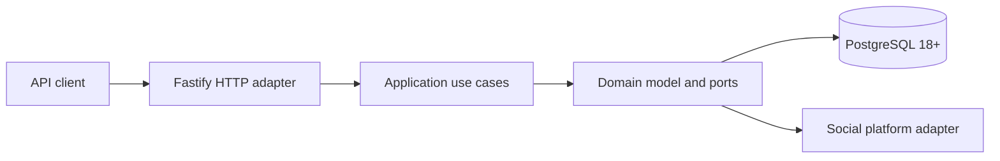

# ThreadBridge

ThreadBridge is a platform-independent TypeScript service for retrieving comments from published
social-media posts and publishing replies through a unified REST API. It is a deliberately small
modular monolith with a Fastify transport, application/domain boundaries, PostgreSQL adapters, and
provider adapters.

<p align="center">
  <a href="https://github.com/dogmator/threadbridge/actions/workflows/ci.yml"></a>
  
  
  
  
  <a href="./LICENSE"></a>
</p>

> Created by **Pavko**.

## Requirements

- Node.js `24.18.1` and npm `11.16.0` for local development.
- PostgreSQL `18` or newer. The checked-in schema uses PostgreSQL 18's built-in `uuidv7()` and the
  migration runner rejects an older server before taking the migration lock or executing DDL.
- Docker with Compose support for the versioned local workflow and container quality gate.

## Architecture



ThreadBridge is one application deployable unit. HTTP transport, use cases, provider adapters, and
PostgreSQL adapters live in one application container; PostgreSQL is separate infrastructure.
Provider calls are always outside PostgreSQL transactions and locks. Future polling, webhook, or
background entry points must reuse the same application boundaries rather than introduce a second
business implementation.

See [`docs/architecture.md`](./docs/architecture.md) for the implementation boundaries and
[`SPECIFICATION.md`](./SPECIFICATION.md) for the behavioral contract.

## Implemented capabilities

- Root-comment and direct-reply retrieval with opaque cursor pagination.
- Reply publication through a provider registry with explicit provider capabilities.
- Durable account-scoped idempotency through `reply_publication_operations`.
- Recovery when a reply was stored before the publication operation was finalized.
- Explicit `pending`, `published`, `retryable_failed`, `failed`, and `indeterminate` operation states.
- A normalized PostgreSQL projection with a database-enforced same-post parent/reply invariant.
- SHA-256 migration history verification and advisory-lock serialization across instances.
- Fastify/TypeBox transport validation with byte-bounded request bodies.
- Per-request server-generated correlation IDs and safe static HTTP error envelopes.
- PostgreSQL-backed readiness, process liveness, structured sanitized request logs, and bounded
  graceful shutdown.
- Compiled non-root production image with no TypeScript sources, tests, `tsx`, or dev dependencies.
- Strict TypeScript, type-aware ESLint, PostgreSQL integration tests, transport tests, compiled
  runtime smoke, and restrictive production-container smoke in CI.

## API at a glance

| Method | Endpoint | Purpose |
| --- | --- | --- |
| `GET` | `/health` | Process liveness; does not depend on PostgreSQL |
| `GET` | `/ready` | PostgreSQL readiness; returns `503` while unavailable |
| `GET` | `/posts/:postId/comments?cursor=<opaque-cursor>` | Retrieve root comments |
| `GET` | `/comments/:commentId/replies?cursor=<opaque-cursor>` | Retrieve direct replies |
| `POST` | `/comments` | Publish a reply |

`POST /comments` requires `Content-Type: application/json` and an `Idempotency-Key` header. A new
reply returns `201`, an identical replay returns `200`, and conflicting key reuse returns `409`.
An oversized body returns `413`; an unsupported media type returns `415`.

The complete machine-readable contract is [`docs/openapi.yaml`](./docs/openapi.yaml).

## Reply publication safety

Before an external write, ThreadBridge creates or loads a durable operation identified by
`(account_id, idempotency_key)` and checks its request fingerprint. Existing published, terminal,
and indeterminate operations are replayed without another provider call. If a stored reply is found
for an unfinished operation, ThreadBridge attaches it and completes the operation locally.

A provider call is never made while a PostgreSQL transaction or lock is held. A pending operation is
replayed through the provider only when the selected adapter declares native publication
idempotency. Without that guarantee, an unsafe repeat becomes `indeterminate` rather than risking a
duplicate external write.

A confirmed provider reply is persisted before the operation is marked `published`. Temporary
failures whose adapter can prove that no write occurred become `retryable_failed`; terminal provider
failures become `failed`; an unknown external outcome becomes `indeterminate`.

Operational state meaning and read-only investigation queries are documented in
[`docs/publication-operations.md`](./docs/publication-operations.md).

## Request and transport safety

The HTTP boundary enforces:

| Input | Limit |
| --- | --- |
| Request body | 64 KiB, measured in received bytes |
| `Idempotency-Key` | 200 characters after trimming |
| Reply content | 10,000 characters |
| Cursor | 4,096 characters |
| Request receive phase | 30 seconds |

`POST /comments` accepts `application/json` case-insensitively and accepts media-type parameters such
as a charset. Content is validated but not normalized or rewritten. For an oversized body or an
unsupported media type, the response is sent once and the connection is made non-reusable so unread
request bytes cannot become another request.

Fastify generates the request correlation ID; caller-provided `x-request-id` values are not trusted
as server correlation IDs. Structured request logs contain the generated request ID, method, route
template, status, and duration. Raw URL/query strings, headers, bodies, credentials, and exception
messages are not included in normal request logs. Successful liveness/readiness probes are omitted
from request-completion logging.

All ordinary API errors use the safe envelope:

```json
{
  "error": {
    "code": "VALIDATION_ERROR",
    "message": "Request validation failed",
    "requestId": "..."
  }
}
```

Readiness is an operational probe and intentionally returns only `{ "status": "ready" }` or
`{ "status": "unavailable" }`.

## Database and migrations

The social platform remains the source of truth for published content and provider identifiers.
PostgreSQL stores the latest normalized local projection and durable publication-operation state.

The migration runner:

- checks PostgreSQL 18+ before locking or applying DDL;
- serializes the complete run with one session advisory lock;
- executes each migration in its own transaction;
- records a SHA-256 checksum for every applied file;
- refuses edited or missing applied migrations;
- refuses to invent checksums for an unverifiable legacy history.

The API and migration connections fail connection establishment after five seconds. Statement and
lock timeouts are deployment/workload policy rather than hard-coded global application constants:
they should be configured for the production database role after representative query and migration
measurement.

Large-database and zero-downtime constraints are documented in
[`docs/migrations.md`](./docs/migrations.md).

## Local demo

`compose.yaml` is a local/demo environment. It intentionally publishes PostgreSQL to the host and
uses demonstrational credentials. Those defaults are **not** a production credential, network, or
secret-management policy.

A clean stack seeds one stable demo post:
`0198f000-0000-7000-8000-000000000002`.

```bash
docker compose up --build -d

curl http://localhost:3000/health
curl http://localhost:3000/ready

export POST_ID=0198f000-0000-7000-8000-000000000002
curl "http://localhost:3000/posts/${POST_ID}/comments"
```

To publish a reply, copy a returned comment `id` into `PARENT_COMMENT_ID`:

```bash
export PARENT_COMMENT_ID='<comment id from the response>'

curl -X POST http://localhost:3000/comments \
  -H 'content-type: application/json' \
  -H 'idempotency-key: demo-reply-1' \
  -d "{\"parentCommentId\":\"${PARENT_COMMENT_ID}\",\"content\":\"Thank you for your comment\"}"
```

Stop the stack with `docker compose down`. Use `docker compose down -v` only when the local demo
database should be discarded.

## Production runtime properties

The checked-in image is a production-shaped application artifact, not a complete deployment
platform. CI proves that the final image:

- runs compiled JavaScript with Node.js `24.18.1` as PID 1;
- runs as the non-root `node` user;
- contains production dependencies and compiled artifacts, but not `tsx`, source TypeScript, or
  tests;
- applies migrations before opening the HTTP listener;
- starts successfully with a read-only root filesystem, all Linux capabilities dropped, and
  `no-new-privileges`;
- exposes database-backed readiness and exits cleanly on `SIGTERM`;
- does not leak a test secret placed in a raw query string into structured logs.

The Node and PostgreSQL base images are pinned by tag **and** digest for reproducibility. A digest
pin is not a vulnerability waiver: production maintenance must regularly rebuild, scan, and repin
base images when upstream security updates are released.

`compose.yaml` gives the API 15 seconds to stop because shutdown can spend up to five seconds closing
active HTTP work and then up to five seconds closing PostgreSQL resources. A production scheduler
must provide at least the same termination budget.

A real deployment still owns environment-specific concerns that this repository cannot choose
safely on its behalf: TLS/ingress, authentication and authorization, external rate limiting/abuse
policy, secret storage and rotation, real provider credentials and deadlines, database role/network
policy, statement/lock timeouts, metrics/tracing, capacity limits, backups, and base-image/container
vulnerability scanning.

## Quality gate

Install exactly the locked dependency graph without lifecycle scripts:

```bash
npm ci --ignore-scripts
npm run check
npm run build
```

The versioned Docker pre-commit gate reproduces the PostgreSQL-backed check in an isolated network:

```bash
.githooks/pre-commit
```

Enable it for Git commits after cloning:

```bash
git config core.hooksPath .githooks
```

CI additionally validates the Compose manifest, audits production npm dependencies at moderate
severity or higher, executes the versioned pre-commit gate itself, builds and smokes compiled
artifacts, inspects the production image, runs it under restrictive container settings, verifies
sanitized logging and graceful shutdown, and requires the repository to remain clean after build.

## Project structure

```text
apps/api/             Fastify HTTP adapter, composition root, PostgreSQL/provider adapters
packages/comments/    Domain model, ports, and application use cases
db/migrations/        Versioned SQL schema and demo seed migrations
tests/                Unit, contract, migration, repository, transport, and integration tests
docs/                 Architecture, operations, migrations, and OpenAPI contract
Dockerfile            Check/build stages and production runtime image
compose.yaml          Local/demo API and PostgreSQL environment
SPECIFICATION.md      Behavioral and architectural contract
```

## Documentation

- [`SPECIFICATION.md`](./SPECIFICATION.md) — behavioral and architectural contract.
- [`docs/architecture.md`](./docs/architecture.md) — implementation boundaries and runtime model.
- [`docs/migrations.md`](./docs/migrations.md) — migration deployment and safety constraints.
- [`docs/publication-operations.md`](./docs/publication-operations.md) — reply-operation states and
  diagnostics.
- [`docs/openapi.yaml`](./docs/openapi.yaml) — machine-readable HTTP contract.
- [`.github/workflows/ci.yml`](./.github/workflows/ci.yml) — repository production-quality gate.
- [`LICENSE`](./LICENSE) — MIT license.
